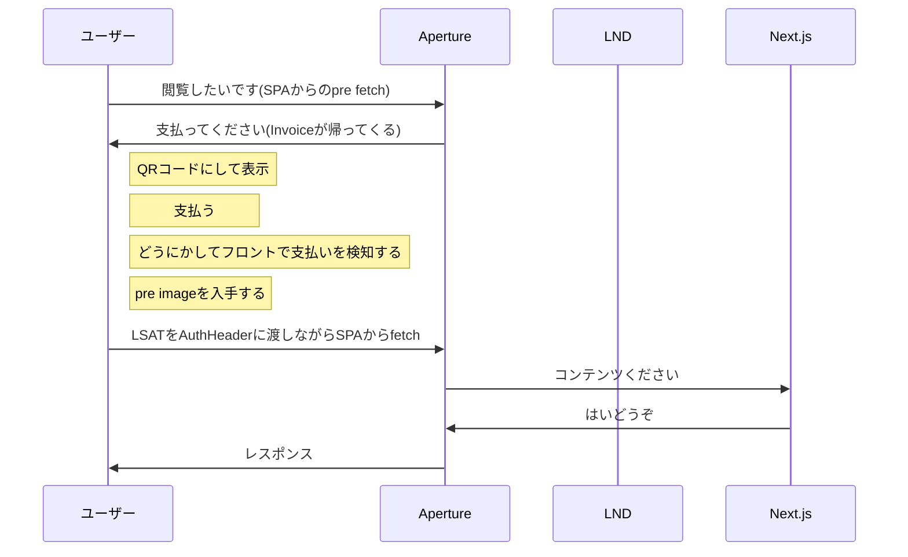
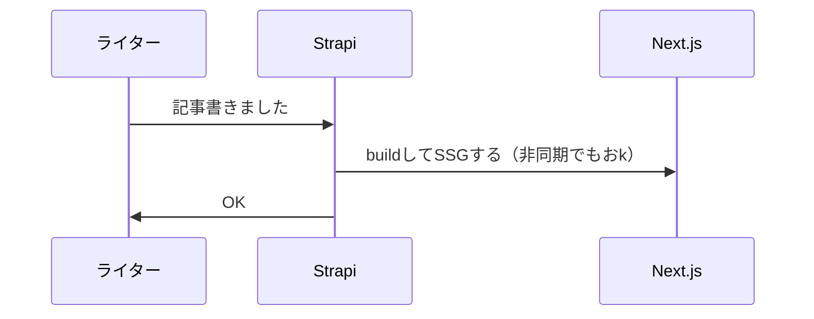
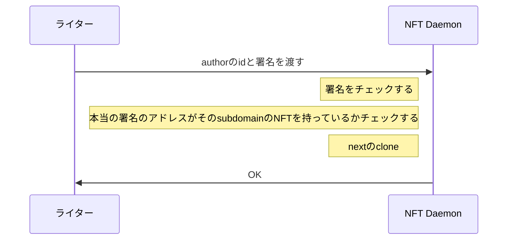

# tokyo-web3-hackathon

test
# Webma

https://blog.2an.co/

**ブログ運営・売買アプリ**

*LN(Lightning Network)を利用した新しい収益モデルによるブログ運営・Webサイト自体のM&Aを可能にするアプリ*

## 概要

### **Pay-As-You-View**

広告によって収益を生み出している従来のようなブログサイトではなく、読者がブログページへ訪れるためにLNによる支払いが必要になるような仕組みが構築されたブログ運営ができる。

### **WebサイトのM&A**

また、ブログ運営者は上記のLNによる収益に加えて、ブログとその運営権をNFTにして売買できる。ブログというコンテンツのみでなく、Webサイトであれば何でもNFTにできるので、今後NFTマーケット上でWebサイトの売買ができ、**WebサイトのM&A**が可能になる。

### 登場人物

- ユーザー(読者): ブログページに訪れるためには、設定された量のsatoshiをLNを利用して支払う。またブログの運営権NFT(EVM)の購入が可能

- ライター(ブログ運営者):　ユーザーがブログページを訪れるごとに収益を得る。ブログの運営権NFTの価格設定と売却が可能。

### 仕組み

*Aperture*

<a href="https://docs.lightning.engineering/the-lightning-network/lsat/aperture">Aperture</a>というプロキシをブログサーバーへ通信する前に設定。HTTPリクエストヘッダー内に、認証トークン(<a hre="https://docs.lightning.engineering/the-lightning-network/lsat/lsat">LSAT</a>)がなければHTTP ステータス402のレスポンス(payment required)をinvoice(LNによる請求書)返す。
レスポンスに含まれるinvoiceへの支払いをLNで行うと、preimageというレシートがもらえるので、それをブログのヘッダーにセットして通信すれば、Apertureが認証してくれてブログが見れるようになるという仕組み。

よってApertureが返すinvoiceへの支払いを行わなければ、ブログページへの通信もできない状態＝ブログ閲覧ができない。

### 今後の展望(実装予定項目)

- NFTのオーナーとLNによる支払い先アドレスの自動紐付け

- EVM上ではなく、<a href="https://docs.lightning.engineering/the-lightning-network/taro">Taro</a>もしくは<a href="https://www.rgbfaq.com/what-is-rgb">RGB</a>を利用してBitcoinブロックチェーン上に運営権NFTを作成

## このリポジトリについて

### `packages/backend`
- <a href="https://strapi.io/">Strapi</a>(headlessCMS)

### `packages/frontend`
- blogのテンプレート。backend(strapi)からAPIで取得した記事を元にnextのSSGする(実装済)

### `packages/nft-daemon`
- 記事が更新されたときに、nextのrebuildをする
- NFTが売買されたときに、オーナーが変わったことをStrapiに知らせる(未実装)

### `packages/contracts`
- Goerliテストネット
- WebmaToken contract

    - ブログ・運営権NFT(https://goerli.etherscan.io/address/0x6e7b4e167987b2faef3e1625fed3f5bd3ef0597f)

- WebmaSwap contract

    - 上記のブログNFTを売買するためのマーケット(https://goerli.etherscan.io/address/0xc34fcb300380d2774228b44a43e6071c1622aa11)

### `packages/ln-pay-server`
- 簡易的なテストネット用のウォレットを開発
- 審査員の方でもlnのノードを立てることなくlnのpaymentが可能に
- Arweave等の分散ストレージに暗号化して保存

## 詳細情報

### 使用したtech stacks

*Frontend*

- Next.js
- wagmi.sh

*Backend(blog)*
- strapi

*Backend(nftdeamon)*
- Rust
- axum
- sqlite

*Smartcontract*
- Solidity
- Foundry
- OpenZeppelin

*Lightning Network*
- aperture
- lnd
- btcd

### 使用したBlockchain
Ethereum, Bitcoin, Lightning Network

### deployしたContract(ExplorerでOK）
- ブログ・運営権NFT(https://goerli.etherscan.io/address/0x6e7b4e167987b2faef3e1625fed3f5bd3ef0597f)
- 上記のブログNFTを売買するためのマーケット(https://goerli.etherscan.io/address/0xc34fcb300380d2774228b44a43e6071c1622aa11)

### application codeやその他のfile

#### LNで支払うとWebサイトがみれる仕組み

#### 記事を書く、編集、公開する仕組み

#### ライター登録

### テスト手順を含むリポジトリへのリンク

### 審査やテストのためにプロジェクトにアクセスする方法など

